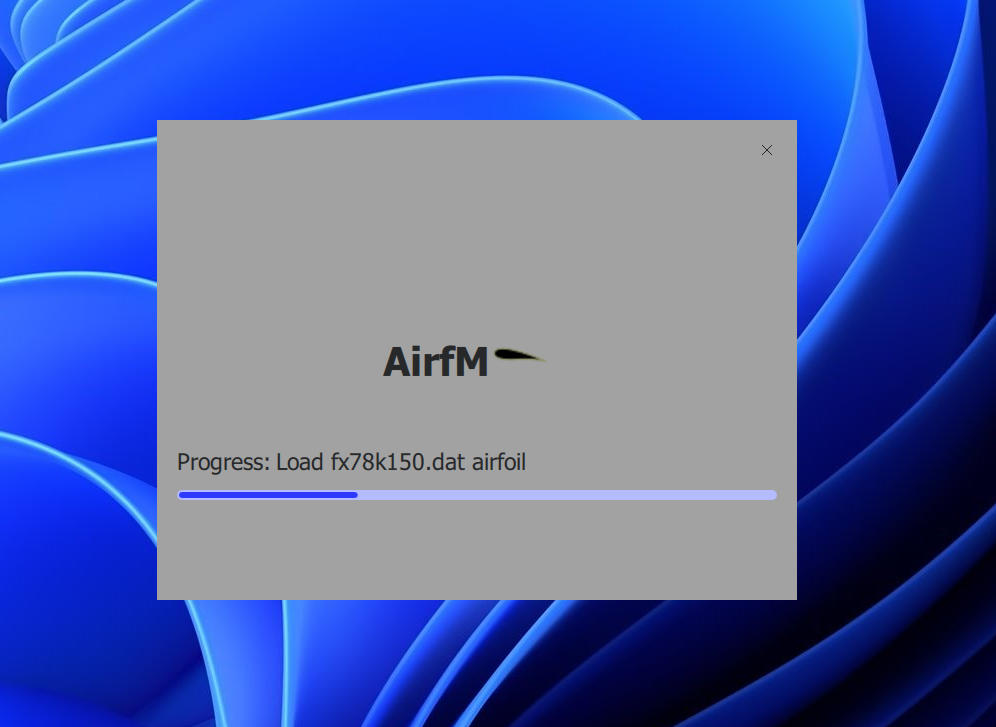
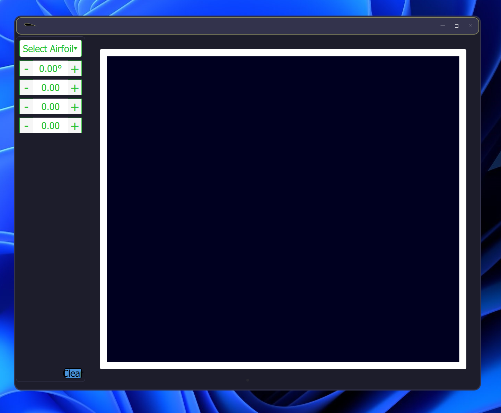

# Airfm

Welcome to Airfm, an Airfoil Data Visualization App! This project is designed to help users visualize UIUC airfoil data in a user-friendly and interactive way. This app provides a convenient way to visualise an airfoil and prepare them to be used as curves in Solidworks and/or other modeling software.

## Features

- **Interactive Plotting**: Visualize airfoil data using interactive plots that allow for zooming, panning, and dynamic updates.
- **Customizable Plot Settings**: Adjust plot settings such as axis labels, tick marks, and plot style to suit your preferences.
- **User-Friendly Interface**: Intuitive user interface designed for ease of use and navigation.

## Getting Started

### Prerequisites

- Python 3.10
- PySide2
- Qt Charts (included with PySide2)

## Contributing

Contributions are welcome! If you'd like to contribute to this project, mail me at [james.o.oluwadare@gmail.com](james.o.oluwadare@gmail.com)

## License

This project is licensed under the GPU-3.0 License - see the [LICENSE](LICENSE) file for details.

## Coming Features

- **Multiple Airfoil Support**: Load data for multiple airfoils and compare their performance side by side.
